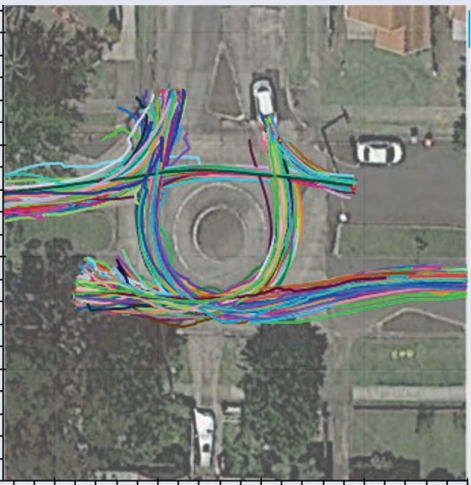
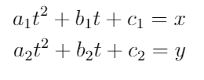

# AV-roundabout-intent-prediction:

## Outline:
* Introduction
* Problem Definition
* Dataset
* Feature extraction
* Creating a model
* Simulator
* Future work
* References

## Introduction:
Autonomous vehicles are currently a very hot research topic, as there are many sub-problems to tackle. Intent recognition is one of the hardest problems, as it's hard for humans as well. The two main approaches to intent recognition are model-based and data-based approach. The model-based approach uses physics and vehicle dynamics to predict the intent of the vehicle. Nowadays, with the existence of accurate sensors, there are many data-sets of vehicle recordings that allow a data-based approach with machine learning.

## Problem Definition:
Intent recognition is the task of predicting the maneuver of a given vehicle. To simplify the problem, we consider the lattice model to limit the number of possible maneuvers based on the scenario. For instance, a vehicle on a highway might shift to the left lane, right lane, or stay in the current lane. In this project, I am focusing on the intersection (roundabout) scenario.

## Dataset:
The data-set was provided from The University of Sydney, and it's a trajectory recording of vehicles going through the intersection. A stationary Lidar sensor was used to track the movement of the vehicle, which is converted to x, and y coordinates. There are around 24 thousand different trajectories in the data-set. 

## Feature extraction:
Each trajectory was split into n-second intervals (in our case 1sec), and the trajectory was represented as second degree polynomial of x, and y with respect to time (t), which results in six different parameters. Average speed and cardinal entering direction are the remaining parameters. Entering direction is represented in hot encoding with three zeros and a one which represents the direction. Which totals to eleven features.
The trajectory is captured one meter before entering the roundabout and one meter after exiting. The output is true (exiting the roundabout) if the remaining timesteps to exit the roundabout is less than n-steps (25-steps in our case= 1sec).

## Creating a model:
Four methods were used to model this problem. First, a deep learning network with two layers both were 128 neurons and RELU activation function and an output layer of single neuron and softmax. Second, a random forest with 1000 estimators and with three features considered as possible split. THE third XG Boost model was used with 100 rounds and a max-depth of 2. Finally, the Ada Boost model was used with 500 estimators.

| Algorithm     | accuracy | error | running time |
|---------------|----------|-------|--------------|
| Deep learning | 99.1%    | 0.004 | 5.4          |
| Random Fores  | 99.8%    | 0.18  | 1.5          |
| XG boost      | 99.8%    | 0.18  | 0.075        |
| Ada Boost     | 98.9%    | 0.18  | 1.24         |

## Simulator:

## Future work:
The five roundabouts from the dataset were a single-lane roundabout with a diameter of 8-10 meters. This means that the model might not generalize to multiple lanes or a different diameter roundabout. So hopefully, with the help of new datasets with multiple lanes or a different diameter roundabout, the model will be able to generalize. A feature that must be added to the model is the distance of the center of the car to the center of the roundabout. This feature captures the size of the roundabout and the specific lane in which the vehicle is driving.

## References:
- http://its.acfr.usyd.edu.au/datasets/five-roundabouts-dataset/

- https://ieeexplore-ieee-org.libconnect.ku.ac.ae/stamp/stamp.jsp?tp=&arnumber=8833491

- https://www.dropbox.com/s/adg1p3iyzjcad3l/five_roundabouts.zip?dl=0

- A video explaining intent recognition: https://youtu.be/ehfA_NC7Ka4
